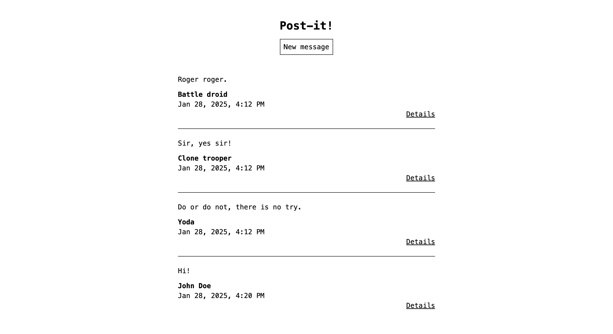

# Post-it!

My implementation of the [mini message board project](https://www.theodinproject.com/lessons/node-path-nodejs-mini-message-board) for [The Odin Project](https://theodinproject.com/). Check out the [live preview](https://competent-sherye-jooo-lee-c3504d9d.koyeb.app/)!

## Description

This is a message board where users can post a message for others to see. It was built using Express and EJS.

## Features

- Renders messages posted by other users
- Allows user to view details of messages

## I learned how to:

- Set up and use routes, controllers and views (in EJS) in Express
- Serve static assets in Express
- Deploy an application using a PaaS
